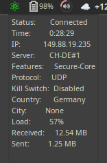
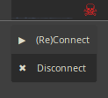

# [Awesomewm](https://awesomewm.org/) Widget for [ProtoVPN](https://protonvpn.com/)

[Awesomewm-Protonvpn Widget](https://github.com/pivaldi/awesomewm-protonvpn) is an
[Awesomewm](https://awesomewm.org/) widget to monitor the current
[ProtonVPN](https://protonvpn.com/) connection status and provides a
simple menu to (re)connect and disconnect the VPN.

This widget uses under the hood the [ProtonVPN Linux
CLI](https://protonvpn.com/support/linux-vpn-tool/), if you don't use
this version of Proton, this widget will not work.

The widget in action :

1. Real-time status connection with a tooltip for detailed information (connection up)

<p align="center">
 
</p>

1. Real-time status connection with a tooltip for detailed information (connection down)

<p align="center">
 
</p>

1. Menu to Connect/Disconnect

<p align="center">
 
</p>

## Customization

It is possible to customize the widget by providing a table with all or
some of the following config parameters :

| Name | Default | Description |
|------|---------|-------------|
| connect_options | "--sc" | See `protonvpn --help` |
| timeout | 10 | The online output used in the widget-bar. See [the One-line output](https://github.com/chubin/wttr.in?tab=readme-ov-file#one-line-output) |
| format_ok | '<span color="#22FF22">⚛</span>' | The markup format to use when connection is up |
| format_ko | '<span color="#FF2222">☠</span>' | The markup format to use when connection is down |
| font | `beautiful.font` | The font to use in the widget bar/tooltip |
| protonvpn_cli_path | "protonvpn" | See `protonvpn` command path |

## Important Note

This widget dose not use `sudo` to manage the connections, It is your
duty to make sure you have the right to execute the `protonvpn`
command and ensure the security of your system.

For example, you can create the file `~/bin/protonvpn` with this kind of code :

```bash
#!/bin/bash

exec sudo /root/.local/pipx/venvs/protonvpn-cli/bin/protonvpn "$@"
```

Make it editable only by root :

```bash
chown root:root ~/bin/protonvpn
chmod 711 ~/bin/protonvpn
```

And in the file `/etc/sudoers.d/YOUR_LOGIN` you can add something like this :


```txt
YOUR_LOGIN ALL = NOPASSWD: /root/.local/pipx/venvs/protonvpn-cli/bin/protonvpn
```

* **Use `sudo visudo -f /etc/sudoers.d/YOUR_LOGIN` to edit the file**
* **Replace `YOUR_LOGIN` by your login name ** ;)
